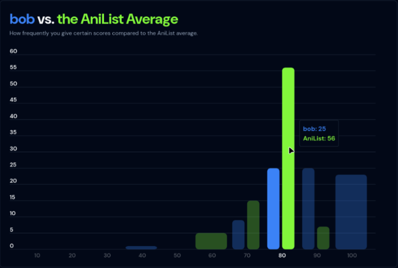
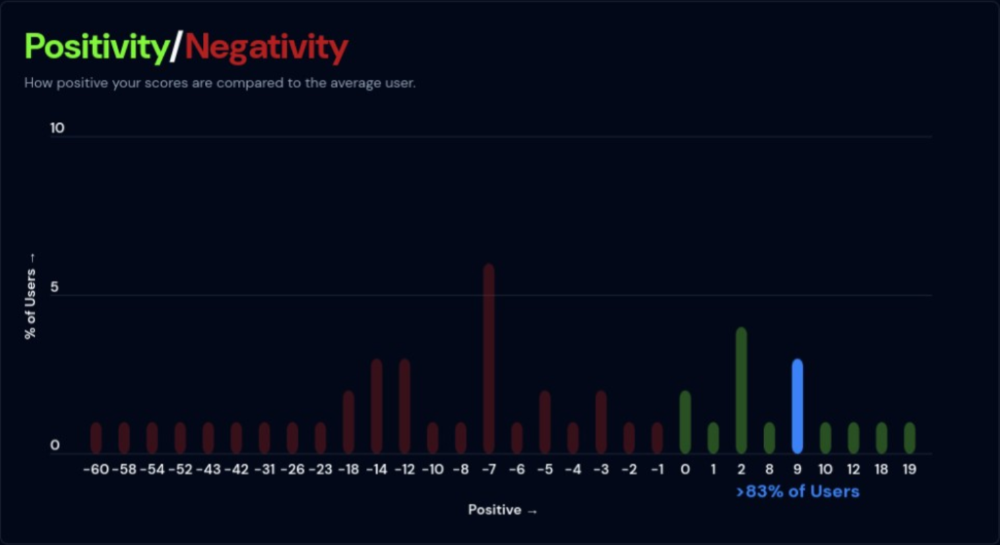

  
  

# Popularity Tool for AniList

### [Official Website](https://www.anipop.uk)

Popularity Tool for AniList is a web app that analyzes your AniList profile to
determine how controversial your anime taste is.

You'll get insights like:

- How controversial your scores tend to be.
- How positive/negative your scores are.
- Your most and least controversial anime takes.

Try it yourself by clicking the link above or going to https://www.anipop.uk!

## Future Plans

1. Beautify the UI.
2. Integrate historical trends to all insights. For example, display if a user's
   scores got more/less controversial since the last time they used the website.
3. Add more interesting insights. For example, a measurement of how obscure your
   anime taste is based on the "Popularity" data from AniList (inspired by
   [Obscurify](https://www.obscurifymusic.com)).

### Why Build This?

I've always been curious how controversial my anime taste is. Am I harsher in my
scoring than most people, or more generous? Since I couldn't find a tool to
answer these questions, I decided to build one myself!
